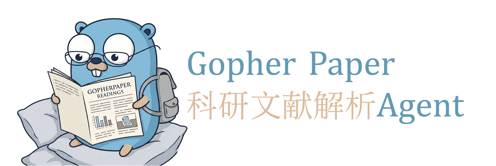

# GopherPaper · 科研文献智能解析与知识服务系统

<p align="center">
  
</p>

基于 [trpc-agent-go](https://github.com/trpc-group/trpc-agent-go) 编排的多智能体论文解析与问答系统:论文上传 → MinerU 解析 → 结构化抽取 → 知识库构建 → 多轮问答(带页码出处与召回配图)→ 研读报告生成。

## 智能体角色

| 名称 | 定位 | 说明 |
| --- | --- | --- |
| 小文鸮 | 论文精读 Agent | 围绕当前论文做精读问答、事实定位、方法解读与摘要概括。 |
| 小云雀 | 先锋工具 Agent | 面向开放任务先行探索,调用外部工具完成学术检索、论文导入与其他可接入操作。 |
| 小囊鼠 | 知识管理 Agent | 面向个人论文库做标签归档、知识卡片、论文关联与长期知识沉淀。 |

## 启动

```bash
# 1. 基础设施
docker compose -f deploy/docker-compose.yml up -d
#   Nginx 统一入口:       http://localhost:8081
#   Milvus 可视化 Attu: http://localhost:8000
#   RabbitMQ 管理台:    http://localhost:15672 (gopher/gopher)
# 2. 配置：填入大模型 API key、MinerU API token、SMTP 授权码等
cp config/config.example.toml config/config.toml

# 3. 启动后端 API
go run cmd/server/main.go

# 4. 启动独立 Next.js 前端
cd frontend && npm install && npm run dev
```

Swagger接口url：<http://localhost:8080/swagger>

前端默认运行在 `http://localhost:3000`。前端的 `/api/v1/*` route handler
会流式代理到 `http://127.0.0.1:8080`,可通过 `GOPHERPAPER_API_ORIGIN` 覆盖。
后端 Swagger 文档可访问 `http://localhost:8080/swagger`，Swagger JSON 为
`http://localhost:8080/swagger/doc.json`。接口注释变更后执行
`go generate ./cmd/server` 重新生成 `docs/`。
如果使用 compose 内的 Nginx 入口,仍按上面方式启动后端和前端,浏览器访问
`http://localhost:8081`;Nginx 会把 `/api/v1/*`、`/swagger` 和 `/healthz` 转发到宿主机
`127.0.0.1:8080` 的 Go 后端,其余请求转发到宿主机 `127.0.0.1:3000` 的
Next 前端,并对 `/api/v1/events` 和聊天消息 SSE 关闭代理缓冲。

具体细节请参考这篇博客[世界的尽头](https://muzimi.org/zh/docs/projects/GopherPaper/Windows%E7%8E%AF%E5%A2%83%E9%85%8D%E7%BD%AE)

## 核心接口

受保护接口走 `Authorization: Bearer <jwt>`;浏览器直连的 SSE、图片与 PDF 文件接口带不了头,鉴权改走 `?token=<jwt>`。

| 鉴权 | 方法 | 路径 | 说明 |
| --- | --- | --- | --- |
| 公开 | POST | `/api/v1/auth/token` | 按 `student_id`、`class_id` 签发调试 JWT |
| 公开 | POST | `/api/v1/user/send-code` | 下发邮箱验证码,body `email` |
| 公开 | POST | `/api/v1/user/register` | 校验验证码并注册,body `student_id`、`name`、`email`、`class_id`、`password`、`code` |
| 公开 | POST | `/api/v1/user/login` | 学号密码登录,返回 JWT 与用户信息 |
| Query Token | GET | `/api/v1/events?token=<jwt>` | SSE 订阅论文解析进度 |
| Query Token | GET | `/api/v1/papers/:id/figures/:name?token=<jwt>` | 取问答召回引用的图片 |
| Query Token | GET | `/api/v1/papers/:id/file?token=<jwt>` | 取原始 PDF,供精读页 pdf.js 渲染 |
| JWT | POST | `/api/v1/user/logout` | 注销当前登录,清服务端登录态与用户模型缓存 |
| JWT | POST | `/api/v1/papers` | 上传 PDF,multipart `file`,上限 50MB,触发异步解析 |
| JWT | GET | `/api/v1/papers` | 列出当前用户论文 |
| JWT | GET | `/api/v1/papers/search?q=` | 历史文献检索 |
| JWT | GET | `/api/v1/papers/:id` | 论文详情、结构化元信息与章节大纲 |
| JWT | GET | `/api/v1/papers/:id/status` | 查询解析状态,作为 WebSocket 断线兜底 |
| JWT | POST | `/api/v1/papers/:id/report` | 生成或读取研读报告,body `type`: `quickread`、`method`、`result`、`innovation`、`future` |
| JWT | POST | `/api/v1/papers/:id/translate` | 精读页选段翻译,body `text`,单次最多 4000 字符 |
| JWT | POST | `/api/v1/sessions` | 新建会话,body 可带 `paper_id`、`title`、`agent_type` |
| JWT | GET | `/api/v1/sessions` | 列出当前用户会话 |
| JWT | DELETE | `/api/v1/sessions/:id` | 删除会话 |
| JWT | GET | `/api/v1/sessions/:id/messages` | 拉取历史消息,含出处与内联图元数据 |
| JWT | POST | `/api/v1/sessions/:id/messages` | 会话内发消息,body `query`,SSE 返回 `plan`、`tool_call`、`tool_result`、`delta`、`done`、`error` 事件 |
