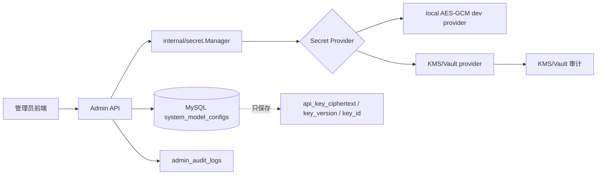

# 管理员模型密钥安全方案调研

生成日期：2026-07-04

## 结论

当前管理员模型配置把模型 API Key 作为 `system_model_configs.api_key` 明文字段保存。前端响应只返回掩码，这是对展示层有帮助，但不能防数据库泄露、备份泄露、DBA 误读、SQL 注入拖库或日志误打。

企业级方案应改成：

1. 数据库只保存密文、密钥版本和必要元数据。
2. 加密主密钥不进入数据库，优先由 KMS/Vault 管理。
3. 应用层只在真正调用模型前短暂解密，避免把明文放进响应、日志和审计详情。
4. 所有密钥变更、测试、读取和解密失败都要可审计，但审计内容只能记录角色、操作者、时间、来源和掩码指纹，不能记录明文。

## 本地现状

关键代码位置：

- `internal/model/model_config.go`
  - `SystemModelConfig.APIKey string gorm:"size:1024" json:"-"`
- `internal/service/admin/model_config.go`
  - `UpdateModelConfig` 直接把 `req.APIKey` 写入 `row.APIKey`
  - `rowToModelConfig`、`applyModelConfigRow` 直接把 `row.APIKey` 注入运行态配置
  - `testOpenAICompatibleModelsEndpoint` 和 `testRerankEndpoint` 直接把 `row.APIKey` 放进 `Authorization: Bearer`
- `config/config.toml`
  - 本地配置文件也存在明文模型密钥形态，生产环境不能把它作为长期密钥仓库。

已经有的保护：

- `json:"-"` 防止 GORM 模型直接序列化 API Key。
- DTO 只返回 `api_key_mask` 和 `has_api_key`。
- 管理员写操作已有 `AdminAudit` 中间件基础。

缺口：

- 数据库明文保存，拖库即泄露。
- 配置文件明文保存，文件权限或备份泄露即泄露。
- 没有密钥版本、轮换状态、密文格式、KMS Key ID、加密上下文。
- 没有统一 secret 管理包，后续 Tavily、Semantic Scholar、OpenAlex、SciVerse、MinerU token 等密钥会继续分散。

## 调研依据

- [OWASP Secrets Management Cheat Sheet](https://cheatsheetseries.owasp.org/cheatsheets/Secrets_Management_Cheat_Sheet.html)：密钥管理要覆盖集中存储、访问控制、审计、轮换和生命周期。
- [OWASP Cryptographic Storage Cheat Sheet](https://cheatsheetseries.owasp.org/cheatsheets/Cryptographic_Storage_Cheat_Sheet.html)：优先使用成熟算法；密钥和密文应分离；不要把密钥硬编码或提交到版本库。
- [OWASP Logging Cheat Sheet](https://cheatsheetseries.owasp.org/cheatsheets/Logging_Cheat_Sheet.html)：日志中不应直接记录 access token、加密密钥和主密钥等敏感信息。
- [AWS KMS data keys](https://docs.aws.amazon.com/kms/latest/developerguide/data-keys.html)：推荐信封加密，每条敏感数据用数据密钥加密，再用包装密钥保护数据密钥。
- [HashiCorp Vault Transit secrets engine](https://developer.hashicorp.com/vault/docs/secrets/transit)：提供加密即服务，应用把密文存回自己的数据库，密钥生命周期和轮换由 Vault 承担。
- [腾讯云 KMS 信封加密](https://cloud.tencent.com/document/product/573/8791)：国内云同样推荐信封加密，DEK 本地加密数据，CMK/KMS 保护 DEK。

## 推荐架构



推荐分两档：

### 第一档：本地可落地

用于开发、本机部署、答辩演示和小规模私有化：

- 新增 `internal/secret` 包。
- 使用 Go 标准库 `crypto/aes` + `cipher.NewGCM`。
- 主密钥来自环境变量或单独本机文件，不进 DB，不进 Git。
- DB 保存：
  - `api_key_ciphertext`
  - `api_key_nonce`
  - `api_key_key_id`
  - `api_key_version`
  - `api_key_fingerprint`
  - `api_key_updated_at`
- 明文 API Key 只在保存、连接测试、模型调用前短暂出现。
- 前端继续只显示 `api_key_mask` / `has_api_key`。

适合现在马上实现，改动量可控。

### 第二档：生产企业级

用于真正企业部署：

- `secret.Manager` 接口保持不变，provider 换成 Vault Transit、阿里云 KMS、腾讯云 KMS、AWS KMS 或 Azure Key Vault。
- 应用服务账号只允许 `encrypt/decrypt` 指定 key，不允许删除 key，不允许管理全局 KMS。
- KMS/Vault 侧开启审计日志和轮换策略。
- 数据库只存密文和 KMS 元数据。
- 轮换时支持双读单写：
  - 新写入使用新 key version。
  - 旧密文仍可按旧 key version 解密。
  - 后台任务逐步 re-encrypt。

## 代码落地设计

### 1. 新增 secret 包

建议接口：

```go
type Manager interface {
    Encrypt(ctx context.Context, purpose string, plaintext string) (Ciphertext, error)
    Decrypt(ctx context.Context, ciphertext Ciphertext) (string, error)
    Fingerprint(plaintext string) string
}

type Ciphertext struct {
    Value      string
    Nonce      string
    KeyID      string
    KeyVersion string
    Algorithm  string
}
```

`purpose` 建议固定为 `admin_model_config:<role>`，作为 AES-GCM AAD 或 KMS encryption context，防止一个角色的密文被挪到另一个角色复用。

### 2. 调整数据库模型

保留兼容字段用于迁移，不建议长期使用：

```go
APIKeyCiphertext string
APIKeyNonce string
APIKeyKeyID string
APIKeyKeyVersion string
APIKeyAlgorithm string
APIKeyFingerprint string
APIKeyMigratedAt *time.Time
```

迁移完成后，旧 `APIKey` 字段应清空。最终可以改名为 `APIKeyLegacy` 或后续删除。

### 3. 保存流程

当前：

```text
req.api_key -> row.APIKey -> DB 明文
```

目标：

```text
req.api_key -> secret.Encrypt -> DB 密文
```

响应仍然：

```text
has_api_key=true
api_key_mask=sk-****abcd
```

不返回明文，不返回完整 fingerprint。

### 4. 运行态加载

当前 `loadModelConfigRows` 读出 row 后直接 overlay。

目标：

```text
load rows -> decrypt only when building runtime config / test request -> inject runtime config
```

注意运行态 config 里仍会持有明文，这是不可完全避免的调用需求；但要限制生命周期和日志输出。后续可以进一步改成按用户/调用懒解密，而不是长期放在全局 runtimeConfig。

### 5. 审计与权限

应记录：

- admin_id
- action: `model_config.secret.update` / `model_config.secret.clear` / `model_config.test`
- role
- provider
- key_fingerprint 前 8 到 12 位
- request_id
- success/failure
- error_type

不能记录：

- `api_key`
- `Authorization` header
- 完整密文
- 完整 fingerprint
- 供应商返回的包含密钥片段的原始错误。

### 6. 前端策略

- API Key 输入框永远不回显明文。
- 替换密钥需要明确点击“替换”。
- 清空密钥需要二次确认。
- 显示“最后更新人/最后更新时间/掩码/测试状态”。
- 生产环境下建议对密钥替换操作要求管理员重新认证或二次确认。

## 优先级路线

P0：立刻做

- 从 `config/config.toml` 清理真实密钥，改为本地私有文件或环境变量注入。
- 确认 `.gitignore` 覆盖 `config/config.toml`、`.env`、密钥文件和数据库备份。
- 增加日志脱敏工具，禁止打印 `api_key`、`Authorization`、`token`。

P1：短期实现

- 新增 `internal/secret` 本地 AES-GCM provider。
- DB 增加密文字段。
- 管理员模型配置保存时加密、读取时解密。
- 加入一次性迁移：发现旧 `api_key` 明文时加密到新字段并清空旧字段。
- 单元测试覆盖保存、读取、迁移、清空、错误脱敏。

P2：企业部署

- 增加 KMS/Vault provider。
- 加入 key version 和 re-encrypt 后台任务。
- KMS 权限最小化。
- 审计日志不可篡改存储或至少定期导出。
- 管理员密钥操作二次确认。

## 风险判断

仅“前端掩码 + json 不返回”不够。它防 UI 泄露，但不防 DB 泄露。

本项目最合适的实现路径是先做本地 AES-GCM provider，把数据结构、迁移和调用路径打通；然后把 provider 替换为 Vault/KMS。这样不会把项目一次性绑死在某一家云服务上，也符合当前 GopherPaper 的包级 `Init` 风格。

## 2026-07-04 第一版实现状态

本轮已先落地“本地可用版”，不修改 `config/config.toml` 与 `config/config.example.toml`。

新增：

- `internal/secret`
  - `LocalManager` 使用 AES-256-GCM。
  - 优先读取环境变量 `GOPHERPAPER_SECRET_KEY`。
  - 未配置环境变量时，自动生成本地私有主密钥文件：`data/secrets/master.key`。
  - `data/` 已在 `.gitignore` 中，主密钥文件不会进入 Git。
  - 加密使用 purpose/AAD：`admin_model_config:<role>`，防止不同模型角色间挪用密文。
  - 提供 HMAC 指纹和掩码工具。

调整：

- `internal/model/model_config.go`
  - 保留旧 `APIKey` 字段作为兼容迁移入口。
  - 新增 `APIKeyCiphertext`、`APIKeyNonce`、`APIKeyKeyID`、`APIKeyKeyVersion`、`APIKeyAlgorithm`、`APIKeyMask`、`APIKeyFingerprint`、`APIKeyMigratedAt`。
- `internal/service/admin/model_config.go`
  - 保存管理员模型配置时，先加密 API Key，再保存数据库；新写入会清空旧明文 `api_key`。
  - 读取数据库配置时，如果发现旧明文 `api_key`，会自动加密迁移到新字段并清空旧字段。
  - 读取数据库配置时，如果发现密文字段，会在内存中解密后用于测试连接和运行态应用。
  - 前端响应仍只返回 `api_key_mask` 和 `has_api_key`。

验证：

```powershell
go test ./internal/secret ./internal/service/admin
```

结果：通过。

运维注意：

- 如果生产环境设置了 `GOPHERPAPER_SECRET_KEY`，必须长期保管并参与备份；更换后旧密文无法解密。
- 如果使用默认本地 key 文件，部署/迁移机器时必须同时迁移 `data/secrets/master.key`。
- `config.toml` 仍按团队默认配置保持原样；本版只保护管理员后台写入数据库的模型 API Key。
