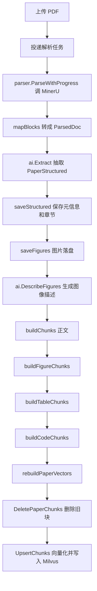

# PDF 论文入库与知识块输出流程

本文说明当前 PDF 论文从 MinerU 解析到 Milvus 知识库的输出方式,重点解释入库时生成的四类 chunk:

1. 正文块
2. 图片块
3. 表格块
4. 代码块

相关代码入口:

- 在线解析流水线: `internal/service/paper/worker.go`
- MinerU 解析映射: `internal/parser/parser.go`
- 图表代码 chunk 构建: `internal/service/paper/figure.go`
- 向量库写入: `internal/service/paper/vector.go`, `internal/knowledge/milvus.go`
- chunk 模型与稳定 ID: `internal/knowledge/store.go`

## 总体流程



状态推进大致是:

```text
uploaded -> parsing -> extracted -> indexed -> ready
```

其中 `indexed` 阶段会构建知识块并写入向量库。

## MinerU 输出如何变成 ParsedDoc

`parser.mapBlocks` 会把 MinerU 的块流归一成 `core.ParsedDoc`:

```go
type ParsedDoc struct {
    Sections   []Section
    Paragraphs []Paragraph
    Figures    []Figure
    Tables     []Table
    CodeBlocks []CodeBlock
    References []string
    PageCount  int
}
```

映射规则:

- `title` 或带 `text_level` 的 `text` 进入 `Sections`,同时更新当前章节路径 `sectionStack`。
- 普通 `text` 进入 `Paragraphs`,并带上当前 `SectionPath` 与页码。
- `equation` 会当成正文段落进入 `Paragraphs`,这样公式能和附近正文一起被召回。
- `page_footnote` 会加上 `脚注: ` 前缀后进入 `Paragraphs`。
- `ref_text` 或 References 章节内的正文进入 `References`,不进入正文 chunk。
- `code` 进入 `CodeBlocks`。
- `table` 优先把 MinerU 的 `table_body` HTML 转成二维网格和 Markdown,进入 `Tables`。
- `table` 如果带表格截图,还会额外生成一个 `Figure`,用于图像展示和带图问答。
- `table` 如果结构化失败,会退化成图片/图表块处理。
- `image` 或 `chart` 进入 `Figures`。

也就是说,后续四类 chunk 不是直接从 PDF 字符串切出来的,而是从 `ParsedDoc` 的结构化字段分别构建出来的。

`ai.Extract` 产出的 `PaperStructured` 仍会保存到 MySQL 的 `paper_metas`,供详情页、关键词筛选、报告输入和图谱使用;但它不再作为 `paper_meta` chunk 写入 Milvus,避免二手摘要占用原文证据召回名额。

## 四类 chunk 的输出

解析 worker 里最终按固定顺序拼出 chunk 列表:

```go
chunks := buildChunks(task, doc)
chunks = append(chunks, buildFigureChunks(task, doc)...)
chunks = append(chunks, buildTableChunks(task, doc)...)
chunks = append(chunks, buildCodeChunks(task, doc)...)
```

### 1. 正文块

来源: `doc.Paragraphs`。

正文切分策略:

- 按文档顺序遍历 `Paragraphs`。
- 同一 `SectionPath` 下的连续段落会合并。
- 如果章节路径变化,先输出当前缓冲区,再开启新块。
- 如果累计正文长度加上下一个段落超过 `MaxChunkRunes`,先输出当前缓冲区,再开启新块。
- `MaxChunkRunes` 当前是 `1000` runes。
- 不因为翻页强制切块。跨页时保留起始页 `page_no`,并在 metadata 里记录 `page_end`。

正文 chunk 的内容会把章节路径前缀进去:

```text
当前章节 / 子章节

段落 1

段落 2
```

输出结构:

```go
knowledge.Chunk{
    Content:    sectionPath + "\n\n" + body,
    Scope:      private,
    OwnerID:    task.OwnerID,
    DocID:      task.PaperID,
    SourceFile: task.FileName,
    PageNo:     startPage,
    ChunkIndex: len(chunks),
    Metadata: {
        "block_type": "text",
        "section": sectionPath,
        "page_end": endPage, // 仅跨页时存在
    },
}
```

这样做的原因:

- 标题语义会进入 embedding。比如用户问“实验方法”,即使正文段落里没有重复完整标题,也能因为章节路径召回。
- 不按页硬切,避免同一小节跨页时语义被切断。
- 页码仍然保留为出处元数据,供回答时回显来源。

注意:

- 正文块会显式设置 `block_type=text`,便于后续按类型过滤、统计和调试。
- 单个超长段落本身不会在 `buildChunks` 里再次拆开;极端超长内容会在向量化阶段由 `MaxEmbeddingRunes` 做兜底截断 embedding 输入。

### 2. 图片块

来源: `doc.Figures`。

图片先在 `saveFigures` 中落盘到:

```text
data/papers/figures/<paperID>/<image-name>
```

然后 `ai.DescribeFigures` 会尝试给图片生成 VLM 描述。失败不阻断入库,图片块会退化为只用 caption 等文本召回。

图片 chunk 的内容由这些字段拼接:

```text
章节路径
图题 / caption
MinerU 图表文本
VLM 图片描述
```

输出结构:

```go
knowledge.Chunk{
    Content:    figureContent,
    Scope:      private,
    OwnerID:    task.OwnerID,
    DocID:      task.PaperID,
    SourceFile: task.FileName,
    PageNo:     fig.PageNo,
    ChunkIndex: len(chunks),
    Metadata: {
        "block_type": "image",
        "img_uri": fig.ImgURI,
        "section": fig.SectionPath,
    },
}
```

跳过规则:

- 如果章节、caption、MinerU 图表文本、VLM 描述都为空,则该图没有可召回文本,不会输出图片 chunk。

作用:

- 普通问答可以通过图题和图描述定位相关图。
- 带图问答可以根据 `block_type=image` 和 `img_uri` 找到图片文件,再把图片返回给前端或喂给 VLM。

### 3. 表格块

来源: `doc.Tables`。

MinerU 的 `table_body` 是 HTML,解析层会先转为二维表格网格,再渲染为 Markdown 表格。表格 chunk 只走文本检索,不会带 `img_uri`。

表格 chunk 的基本内容:

```text
章节路径
表题 / caption
Markdown 表格
```

短表格:

- 如果整张表不超过 `MaxChunkRunes`,整表输出为一个 table chunk。

长表格:

- 优先按行分组。
- 每个分组都会带表题和 Markdown 表头。
- metadata 记录 `row_start` 和 `row_end`。

超长单行:

- 如果某一行自己就超过上限,会按列或长单元格拆。
- 拆分时保留:
  - 表题
  - 表格行号
  - 列名
  - 同一行的短字段上下文

输出结构:

```go
knowledge.Chunk{
    Content:    sectionPath + "\n" + tablePart,
    Scope:      private,
    OwnerID:    task.OwnerID,
    DocID:      task.PaperID,
    SourceFile: task.FileName,
    PageNo:     tbl.PageNo,
    ChunkIndex: len(chunks),
    Metadata: {
        "block_type": "table",
        "section": sectionPath,
        "table_part": 1,
        "table_parts": totalParts,
        "row_start": 1,
        "row_end": 5,
    },
}
```

作用:

- 表格中的方法、指标、实验结果可以被文本检索命中。
- 长表不会整张塞进一个巨大 chunk,避免召回粒度过粗。
- 行号和列名让答案可以更准确地引用表格局部内容。

### 4. 代码块

来源: `doc.CodeBlocks`。

代码块用于算法、伪代码、prompt、配置片段等内容。它们不混入普通正文,而是独立输出,避免丢失代码边界。

内容拼接方式:

```text
章节路径
代码标题 / caption
代码正文 / body
```

输出结构:

```go
knowledge.Chunk{
    Content:    codeContent,
    Scope:      private,
    OwnerID:    task.OwnerID,
    DocID:      task.PaperID,
    SourceFile: task.FileName,
    PageNo:     code.PageNo,
    ChunkIndex: len(chunks),
    Metadata: {
        "block_type": "code",
        "section": code.SectionPath,
        "language": code.Language,
    },
}
```

作用:

- 用户问“算法步骤”“伪代码”“prompt 怎么写”时,代码块可以被单独召回。
- 保留 `language` 方便后续展示或检索增强。

## 写入 Milvus 前的统一规整

所有 chunk 最后都会进入:

```go
rebuildPaperVectors(ctx, task, chunks, mode)
```

这个函数做两件事:

1. 删除这篇论文旧的向量块。
2. 调 `knowledge.UpsertChunks` 重新写入新块。

`UpsertChunks` 会对每个 chunk 做统一规整:

- 去掉空白内容。
- 校验私有知识必须有 `OwnerID`。
- 自动补 `CreatedAt`。
- 生成稳定 ID。
- 调 embedding 模型把 `Content` 转成向量。
- 写入 Milvus document。

稳定 ID 的输入字段包括:

```text
scope
owner_id
doc_id
source_file
source_uri
page_no
chunk_index
content
```

因此同一篇论文重复解析时,相同内容和相同位置的 chunk 会得到相同 ID,便于幂等写入。

## Milvus 中最终长什么样

最终写入 Milvus 的是:

```go
document.Document{
    ID:       chunk.ID,
    Content:  chunk.Content,
    Metadata: chunkMetadata(chunk),
}
```

另有一条向量:

```go
vec := embedding(chunk.Content)
```

metadata 会统一包含:

```text
knowledge_scope
student_id
doc_id
source_file
source_uri
page_no
chunk_index
created_at
```

再合并每类 chunk 自己的 metadata,例如:

```text
section
page_end
block_type
img_uri
table_part
table_parts
row_start
row_end
language
```

## 检索时如何使用这些输出

正文问答:

- 通过 Milvus 向量检索召回普通正文块、表格块、代码块等。
- 检索过滤会限制:
  - public 知识库全员可见
  - private 知识库只允许当前 `student_id`
  - 如果绑定当前论文,会限制 `doc_id`

带图问答:

- 图片块单独按 `block_type=image` 检索。
- 命中后使用 `img_uri` 找到本地图片。
- 来源 metadata 会保留页码、文件名、章节等信息。

出处回显:

- `page_no` 表示 chunk 起始页。
- `page_end` 表示跨页终止页,只有跨页 chunk 才有。
- `source_file` 表示原 PDF 文件名。
- `chunk_index` 表示构建函数内部的片段序号。

## 当前策略的几个关键特点

- 这是结构感知切分,不是简单按页或按固定字符粗切。
- 正文以章节路径为主边界,页码只是出处元数据。
- 图片、表格、代码分别输出为不同类型的 chunk。
- 表格长内容会专门拆行、拆列,比直接把 Markdown 长表塞进一个块更稳。
- 所有 chunk 都带租户信息,保证私有论文只在当前用户范围内可见。
